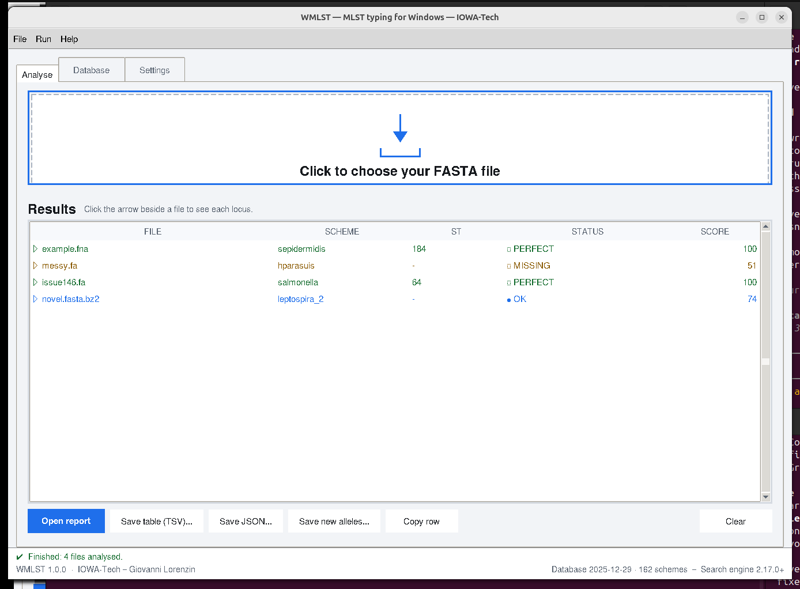

<div align="center">


# WMLST

**MLST typing for Windows.** A native port of [`mlst`](https://github.com/tseemann/mlst)
by Torsten Seemann — same numbers, same output, no WSL, no Docker, no Perl.

[](https://github.com/iowa69/WMLST/actions/workflows/ci.yml)
[](https://github.com/iowa69/WMLST/releases)
[](LICENSE)
[](https://www.python.org/)
[](#)
[](#the-database)
[](#the-database)

*by **IOWA-Tech** — **Giovanni Lorenzin***

</div>

---

WMLST reads assembled bacterial contigs and tells you the multi-locus sequence type.
Give it a FASTA (or GenBank, or EMBL, gzipped or not), and it scans all 162 PubMLST
schemes, picks the one that fits, and prints the ST.

```
FILE             SCHEME         ST    arcC  aroE  gtr  mutS  pyrR  tpiA  yqiL
example.fna      sepidermidis   184   16    1     2    1     2     1     1
```

It is **output-compatible with `mlst` 2.35.0**, byte for byte, against a golden corpus
generated by running the real Perl program. If a pipeline downstream of you parses
`mlst` output, it will parse this.

> [!IMPORTANT]
> **WMLST is for research use only.** It is not a medical device, it is not IVDR- or
> FDA-cleared, and it must not be the sole basis for a clinical or regulatory decision.

---

## Table of contents

- [Quickstart for Windows](#quickstart-for-windows-three-steps)
- [Screenshots](#screenshots)
- [Install from Python](#install-from-python)
- [Command-line reference](#command-line-reference)
- [Output formats](#output-formats)
- [The database](#the-database)
- [Updating the database](#updating-the-database)
- [Troubleshooting](#troubleshooting)
- [Windows notes](docs/WINDOWS.md)
- [Attribution and licence](#attribution-and-licence)
- [About IOWA-Tech](#about-iowa-tech)

---

## Quickstart for Windows (three steps)

You do not need Python. You do not need WSL. You do not need to know what a terminal is.

### Step 1 — Download

Go to the [**Releases**](https://github.com/iowa69/WMLST/releases/latest) page and take
**one** of these:

| | |
| :-- | :-- |
| **`WMLST-<version>-win64-setup.exe`** | Installs WMLST, puts it in the Start menu and on your desktop. Choose this one if you are not sure. |
| **`WMLST-<version>-win64-portable.zip`** | No installation. Unzip it anywhere — a USB stick is fine — and run `WMLST.exe` from inside the folder. |

Both contain everything: all 162 schemes, all 225,777 alleles, and the NCBI BLAST+
search engine. **Nothing is downloaded on first run**, and Python is not required.

> **Windows will probably say "Windows protected your PC".**
> Click **More info**, then **Run anyway**.
>
> This is not a virus warning. WMLST is **not code-signed** — an Authenticode
> certificate costs several hundred euro a year, which an independent tool cannot
> assume — so SmartScreen has simply never seen this file before and says so. We are
> not going to pretend otherwise. If you would like to check the download yourself,
> every release publishes `SHA256SUMS.txt` and links the public build log that
> produced the file. In PowerShell:
>
> ```powershell
> Get-FileHash .\WMLST-1.0.1-win64-setup.exe -Algorithm SHA256
> ```
>
> We will never ask you to switch off SmartScreen or Defender, or to edit the registry.
> The whole story is in [`docs/WINDOWS.md`](docs/WINDOWS.md).

The installer writes into your own user folder, so **no administrator password is
needed**.

### Step 2 — Start it

Double-click the **WMLST** icon on your desktop, or find it in the Start menu.

The very first time, WMLST spends about a minute building its search index from the
bundled allele files. It does this by itself and shows a progress bar. It only ever
happens once.

### Step 3 — Drop a FASTA file on the window

Drag one or more assemblies onto the big box — `.fasta`, `.fa`, `.fna`, `.gbk`,
`.embl`, and any of those `.gz`, `.bz2` or `.zip`.

**Analysis starts on its own.** There is no button to press. When it finishes you get
the scheme, the sequence type, and a per-locus breakdown you can expand to see the
individual alleles and the BLAST hits behind them — plus **Open report**, **Save table
(TSV)** and **Save JSON**.

That is the whole thing.

<details>
<summary><strong>Prefer the command line?</strong></summary>

The installer also provides `wmlst-cli.exe`. Tick *"Add the command-line tool to my PATH"*
during setup, then:

```powershell
wmlst-cli C:\data\assemblies\isolate01.fasta
wmlst-cli --full C:\data\assemblies\*.fasta > results.tsv
```

</details>

---

## Screenshots



*Four assemblies typed in one batch. Drop files on the box and analysis starts by
itself; every row expands to show the individual loci and the BLAST hits behind
each allele call. The footer always states which database and which search engine
produced the result.*

Every call above matches `mlst` 2.35.0 exactly: `sepidermidis` ST 184, `hparasuis`
with four inexact loci, `salmonella` ST 64, and `leptospira_2` at score 74.

---

## Install from Python

WMLST is a normal Python package with **zero mandatory third-party dependencies**.
Python 3.9 or newer, on Windows, Linux or macOS.

```bash
python -m pip install wmlst
```

or from a checkout:

```bash
git clone https://github.com/iowa69/WMLST.git
cd WMLST
python -m pip install -e ".[dev]"
```

You also need NCBI BLAST+ (`blastn` and `makeblastdb`) version 2.9 or newer:

| Platform | How |
| :-- | :-- |
| Windows | `wmlst --bootstrap-blast` (downloads and verifies the official NCBI archive) |
| Debian/Ubuntu | `sudo apt install ncbi-blast+` |
| conda | `conda install -c bioconda blast` |
| macOS | `brew install blast` |

Then build the search index once:

```bash
wmlst --make-blast-db
wmlst --check          # prints what it found; exits 0 when everything is ready
```

Optional extras:

```bash
python -m pip install "wmlst[gui]"     # tkinterdnd2, for drag-and-drop in the GUI
python -m pip install "wmlst[test]"    # pytest and friends
python -m pip install "wmlst[build]"   # pyinstaller, for building the Windows exe
```

---

## Command-line reference

```
SYNOPSIS
  Automatic MLST calling from assembled contigs
USAGE
  % wmlst --longlist                                        # list known schemes
  % wmlst [options] <contigs.{fasta,gbk,embl}[.gz]>         # auto-detect scheme
  % wmlst --scheme <scheme> <contigs.{fasta,gbk,embl}[.gz]> # force a scheme
```

### General

| Option | Meaning |
| :-- | :-- |
| `--help` | This help |
| `--version` | Print version and exit |
| `--check` | Just check dependencies and exit |
| `--skipcheck` | Skip the dependency check at runtime |
| `--quiet` | No progress output on stderr |
| `--threads INT` | Number of BLAST threads (default `1`) |
| `--debug` | Verbose debug output on stderr |
| `--fofn STR` | Read input filenames from this file, one per line |

### Scheme

| Option | Meaning |
| :-- | :-- |
| `--scheme STR` | Do not auto-detect; force this scheme (also sets `--minscore 0`) |
| `--info` | Print scheme, loci, ST and allele counts |
| `--list` | List available scheme names on one line |
| `--longlist` | List every scheme with its loci |
| `--exclude STR` | Ignore these schemes (default `ecoli,abaumannii,vcholerae_2,senterica_achtman_2`) |

### Output format

| Option | Meaning |
| :-- | :-- |
| `--full` | Detailed output: adds SCHEME, ST and the per-locus evidence (recommended) |
| `--legacy` | Old output with an allele header row (requires `--scheme`) |
| `--csv` | Comma-separated instead of tab-separated |
| `--label STR` | Print this instead of the filename in the FILE column |
| `--nopath` | Strip directories from the FILE column |

### Output files

| Option | Meaning |
| :-- | :-- |
| `--outfile STR` | Write to this file instead of stdout |
| `--novel STR` | Write novel (unmatched) alleles to this FASTA file |
| `--json STR` | Also write the results as JSON |

### Scoring

| Option | Meaning |
| :-- | :-- |
| `--minid NUM` | DNA %identity for a full-length allele to count as similar, `~` (default `95`) |
| `--mincov NUM` | DNA %coverage to report a partial allele, `?` (default `50`) |
| `--minscore NUM` | Minimum score out of 100 for a scheme to be reported (default `50`) |

### Database

| Option | Meaning |
| :-- | :-- |
| `--blastdb STR` | BLAST database prefix (default `$WMLST_DBDIR/blast/mlst.fa`) |
| `--datadir STR` | PubMLST data folder (default `$WMLST_DBDIR/pubmlst`) |

`WMLST_DBDIR` selects the database root. `MLST_DBDIR` is honoured too, so a script
written for upstream `mlst` keeps working unchanged.

### WMLST extras

These are additions. **None of them changes a number in a compatible output.**

| Option | Meaning |
| :-- | :-- |
| `--html STR` | Write a self-contained HTML report (no external files, no internet) |
| `--evidence-tsv STR` | Write the per-hit BLAST evidence table |
| `--jobs INT` | Analyse this many input files at once |
| `--gui` | Launch the graphical interface |
| `--blast-timeout NUM` | Seconds before a stuck `blastn` is killed (default `900`) |
| `--repair-locus-ids` | Recover the 108 alleles whose id the upstream sseqid regex drops. **Off by default: results will NOT match `tseemann/mlst`.** |
| `--html-evidence none\|best\|all` | How much BLAST evidence the HTML report shows |

Every boolean above also accepts a `--no-` form (`--no-quiet`, `--no-full`, …).

### Maintenance commands

| Command | Meaning |
| :-- | :-- |
| `wmlst --bootstrap-blast` | Download and verify NCBI BLAST+ into your user profile (Windows) |
| `wmlst --make-blast-db` | Rebuild the derived BLAST index from `db/pubmlst` |
| `wmlst --update-db` | Refresh the allele database from PubMLST and Institut Pasteur |
| `wmlst-gui` | The graphical interface |
| `wmlst-show-seqs -s SCHEME -t ST` | Print the allele sequences of one sequence type |

---

## Output formats

**Default (TSV)** — one row per file: filename, scheme, ST, then one column per locus.

```
example.fna	sepidermidis	184	arcC(16)	aroE(1)	gtr(2)	mutS(1)	pyrR(2)	tpiA(1)	yqiL(1)
```

The symbols in the allele column mean exactly what they mean upstream:

| Symbol | Meaning |
| :-- | :-- |
| `n` | exact match to allele *n* |
| `~n` | novel allele, closest to *n* (full length, ≥ `--minid`) |
| `n?` | partial match to *n* (≥ `--mincov` of the locus) |
| `-` | locus not found at all |
| `n,m` | more than one exact allele matched |

**`--full`** adds the scheme, the ST and the per-locus detail in one wider table.
**`--csv`** is the same data, comma-separated. **`--json`** writes a structured record
per sample. **`--html`** writes a single self-contained file — no CDN, no fonts, no
`fetch()` — that opens in any browser, online or not.

---

## The database

WMLST ships the database. There is nothing to download before your first run.

| | |
| :-- | --: |
| Schemes | **162** |
| Loci | **1,108** |
| Alleles | **225,777** |
| Snapshot | **2025-12-29** |

The allele sequences are verbatim bytes from the public anonymous endpoints of
[PubMLST](https://pubmlst.org) and [BIGSdb Pasteur](https://bigsdb.pasteur.fr). They are
never re-wrapped, re-sorted or line-ending-converted: an allele's MD5 is part of the
output, so a single changed byte would change results. `.gitattributes` enforces this.

The BLAST index in `db/blast/` is **derived**, gitignored, and rebuilt locally with
`wmlst --make-blast-db` in about twelve seconds.

---

## Updating the database

The bundled snapshot is fine for most work, and pinning it is what makes results
reproducible. When you do want to refresh:

```bash
wmlst --update-db              # check, show what changed, ask, then apply
wmlst --update-db --check-only # just report what is out of date
wmlst-update-db                # the same thing as its own command
```

or, in the GUI, the **Database** tab.

What it does:

1. Asks PubMLST and Pasteur for each scheme's current content (about 230 KB, ~15 s).
2. Compares a **content hash**, not a date. Upstream's `last_updated` field advances
   daily even when the anonymous payload is identical, so a date-based updater would
   re-download all 162 schemes forever.
3. Downloads only what actually changed, validates it, and commits each scheme
   atomically — an interrupted update never leaves a half-written scheme.
4. Rebuilds the BLAST index and stamps `db/VERSION.txt`.

`wmlst --rollback-db` restores the previous snapshot. For air-gapped machines,
`--export-bundle` / `--import-bundle` move a verified snapshot on a USB stick.

**Updating changes your results.** New alleles and new STs appear; a genome that was
`ST -` may become `ST 4471`. Record the database version alongside your results — it
is in every JSON and HTML report, and in `db/VERSION.txt`.

---

## Troubleshooting

<details>
<summary><strong>"Windows protected your PC"</strong></summary>

Expected. WMLST is not code-signed. Click **More info → Run anyway**. See
[Step 1](#step-1--download-and-install) and `SMARTSCREEN.txt` in the install folder.
</details>

<details>
<summary><strong>blastn fails immediately with a 0xC0000135 error</strong></summary>

A missing Microsoft Visual C++ runtime, not a WMLST problem. Install the
[VC++ 2015-2022 x64 redistributable](https://aka.ms/vs/17/release/vc_redist.x64.exe)
and try again.
</details>

<details>
<summary><strong>"Sequence contains no data"</strong></summary>

The input file has a FASTA header with nothing under it, or is empty. This message
comes from BLAST itself and is passed through unchanged for compatibility.
</details>

<details>
<summary><strong>Everything is ST "-" and the scheme is blank</strong></summary>

Your assembly may be from a species with no PubMLST scheme, or it may be too
fragmented — MLST needs each of the ~7 loci on a single contig. Run with `--full` to
see which loci were found, and `--minscore 0` to see the best scheme regardless.
</details>

<details>
<summary><strong>Results differ from `mlst` on Linux</strong></summary>

They should not, and that is a bug — please
[open an issue](https://github.com/iowa69/WMLST/issues) with the input file. Two known
exceptions, both deliberate: `--repair-locus-ids` (off by default, and it says so) and
exact score ties, which upstream breaks with a randomised hash order and WMLST breaks
by scheme name.
</details>

<details>
<summary><strong>Antivirus quarantines WMLST.exe</strong></summary>

An unsigned PyInstaller binary is a common false positive. The file is not compressed
with UPX (which makes it worse), the build log is public, and `SHA256SUMS.txt` lets you
confirm you have exactly what CI produced. Add an exclusion for the install folder, or
use the Python package instead.
</details>

---

## Attribution and licence

**Please cite the original work first. Without it there is nothing here to port.**

1. **Torsten Seemann**, `mlst`, <https://github.com/tseemann/mlst>
2. **Jolley KA, Bray JE, Maiden MCJ (2018)** "Open-access bacterial population genomics:
   BIGSdb software, the PubMLST.org website and their applications."
   *Wellcome Open Research* **3**:124.
   [doi:10.12688/wellcomeopenres.14826.1](https://doi.org/10.12688/wellcomeopenres.14826.1) ·
   PMID **30345391**
3. **WMLST**, IOWA-Tech — Giovanni Lorenzin, <https://github.com/iowa69/WMLST>
   (cite the version you used; `wmlst --version` prints it, and every JSON and
   HTML report records it alongside the database date)

`CITATION.cff` in this repository carries all three in machine-readable form.

### Licence

WMLST is **`GPL-2.0-only`**, and it could not be anything else.

Upstream `mlst` is licensed under the GNU General Public License **version 2**, with no
"or any later version" clause. A port is a translation, and a translation is a
derivative work under GPLv2 §0, so GPLv2 §2(b) requires this whole program to be
licensed under those same terms — not GPLv3, not MIT, and not "GPLv2 for the ported
parts and something else for the new ones".

**What that means for you, plainly:**

- You may use WMLST for anything, including commercially, at no charge.
- You may copy, modify and redistribute it — **provided** you pass on the complete
  corresponding source under the same GPLv2 terms, keep the copyright notices, and
  state what you changed.
- You may **not** fold it into a closed-source product, and you may **not** relicense
  it under a permissive or a later GPL licence.
- It comes with **absolutely no warranty**.

The full text is in [`LICENSE`](LICENSE); the derivation, the data provenance, the
BLAST+ status and the source-code offer are set out in [`NOTICE`](NOTICE).

This is also why WMLST has **zero mandatory third-party runtime dependencies**: a GPLv2
work cannot link an Apache-2.0 library, because the patent-termination clause is a
further restriction GPLv2 §6 forbids. `scripts/check_stdlib_only.py` enforces that rule
in CI, and any proposed dependency needs a licence review first.

### Third-party components

| Component | Licence | Role |
| :-- | :-- | :-- |
| [`mlst`](https://github.com/tseemann/mlst) by Torsten Seemann | GPL-2.0-only | the program WMLST is a port of |
| [PubMLST](https://pubmlst.org) / [Institut Pasteur](https://bigsdb.pasteur.fr) allele data | curators' terms for anonymous access | the database in `db/pubmlst` |
| [NCBI BLAST+](https://blast.ncbi.nlm.nih.gov/) | public domain (US Government Work) | the search engine, invoked as a separate process |
| `tkinterdnd2` | MIT | optional drag-and-drop in the GUI |
| PyInstaller, Inno Setup | build-time only | producing the Windows binaries |

---

## About IOWA-Tech

WMLST is the **first of a series of bioinformatics tools that IOWA-Tech is porting to
Windows**. The premise is simple and slightly unfashionable: an enormous amount of
excellent microbial-genomics software assumes a Unix shell, and a great many of the
microbiologists who need it are sitting in front of a Windows laptop in a hospital lab,
with no root, no WSL, and no appetite for a container runtime. That should not be the
thing that stops them.

So each tool in the series gets the same treatment:

- **a native Windows build** — one installer, no administrator rights, no WSL;
- **identical numbers** — verified byte-for-byte against the original implementation,
  because a port that "mostly agrees" is worse than no port at all;
- **a real graphical interface** for people who do not live in a terminal, with the
  command line kept intact for people who do;
- **the original authors credited first**, and the original licence respected.

Built and maintained by **Giovanni Lorenzin** at **IOWA-Tech**.

Bug reports and pull requests are welcome — see [`CONTRIBUTING.md`](CONTRIBUTING.md).

---

<div align="center">

**WMLST** · IOWA-Tech — Giovanni Lorenzin · GPL-2.0-only<br>
Port of [`mlst`](https://github.com/tseemann/mlst) 2.35.0 by Torsten Seemann<br>
Allele data © PubMLST / Institut Pasteur — cite
[Jolley, Bray & Maiden (2018)](https://pubmed.ncbi.nlm.nih.gov/30345391/)<br>
*Research use only. Not a medical device.*

</div>
