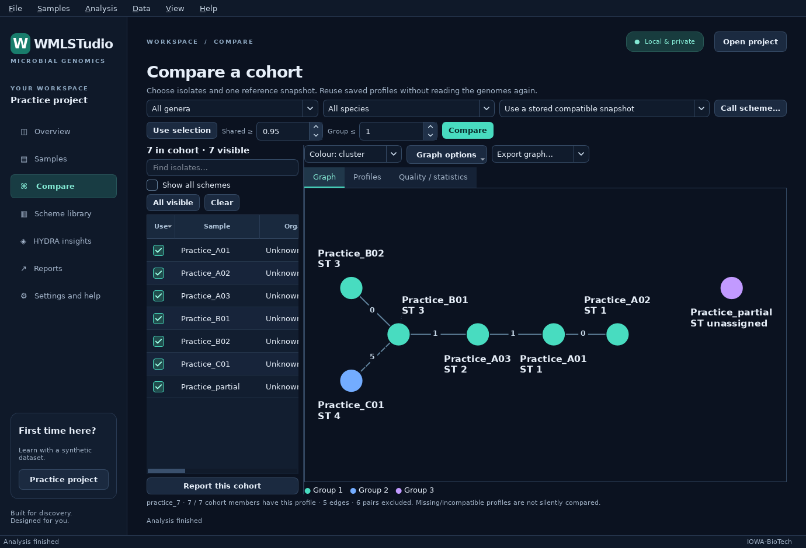

# WMLSTudio

A local microbial-genomics workbench for non-commercial research on Windows:
import, assemble paired reads, type, investigate AMR evidence, compare saved
isolates and report a defined cohort.

Native dark Qt desktop. No browser server, WSL, Docker or separate Python
installation for the portable package.

*IOWA-BioTech — Giovanni Lorenzin*

## Download and retest

### [⬇ Download WMLSTudio — Windows portable ZIP](https://github.com/iowa69/WMLSTudio/releases/download/v0.4.1/WMLSTudio-0.4.1-Windows-x64.zip)

**v0.4.1 · Windows x64 · 390 MB ZIP · Non-commercial research**

Unzip and run `WMLSTudio.exe`. No installer, no Python, no WSL, no Docker.
SHA-256 `bce42737a232fc7efbe8b606e3713028a66b8a9760e11c4a41259fbb64d00af8`.

[Release notes](https://github.com/iowa69/WMLSTudio/releases/tag/v0.4.1)
· [SHA-256 checksum](https://github.com/iowa69/WMLSTudio/releases/download/v0.4.1/WMLSTudio-0.4.1-Windows-x64.zip.sha256)
· [Previous 0.2 release](https://github.com/iowa69/WMLSTudio/releases/tag/v0.2.0-workbench.1)
· [Build/test results](https://github.com/iowa69/WMLSTudio/actions/workflows/studio.yml)
· [Previous 0.1 release](https://github.com/iowa69/WMLSTudio/releases/tag/v0.1.0-preview.1)

The release notes distinguish observed Linux, native Windows CI and Wine checks
from the still-required clean Windows 11 desktop acceptance test.
The published binary was built from `dfa1b55`: **1,799 tests passed on each
hosted platform**, followed by the frozen-build, app-local Windows dependency,
size-budget and bundled-reference checks in
[this successful build](https://github.com/iowa69/WMLSTudio/actions/runs/34984932244).
Clean Windows 11 desktop acceptance has still not been done.

> Research software, not a validated diagnostic device or an established
> SeqSphere+ equivalent. Review the [capability audit](docs/STUDIO_CAPABILITIES.md).
> The application is unsigned. Check the source and checksum before deciding to
> run it; do not disable Defender or SmartScreen. A checksum establishes file
> integrity, not safety or clinical validity.

## Three steps to the desktop

### 1. Extract the entire folder

Choose **Extract All**, use a writable folder such as Documents, then open
`WMLSTudio/WMLSTudio.exe`. Keep every executable and the `_internal` folder
together. Do not launch from inside the ZIP or move only the main executable.
The extracted application occupies about 462 MB, before your projects and inputs.

Keep your existing data backed up. Open a **copy** of an older project for the
first retest: the workbench upgrades its project schema, and the old 0.1
application cannot read the upgraded project.

### 2. Explore the practice project

Use **Help → Practice project**. Seven explicitly synthetic assemblies let you
test navigation, sample selection, comparisons, graph options and reports.

For real data to practise on, two pinned cohorts of published complete genomes
can be downloaded and checksum-verified: ten *K. pneumoniae* genomes, or twenty
genomes across fifteen genera that deliberately include the hard calls. No
sequence ships in the ZIP, and no expected answer ships with either cohort. See
[practice cohorts](docs/TEST_DATASETS.md).



*Native Windows application; synthetic demonstration data, not a clinical cohort.*

### 3. Import and review your own samples

Drop FASTA/FASTQ files or a folder into Overview. The import dialog supports:

- Automatic classical-MLST discovery, manual organism/scheme, or unknown.
- Per-file assignments and apply-to-selected/apply-to-all controls.
- Optional local input copies, organism/ST organization and ST filename suffixes.

On **Samples**, review the selection and choose **Analyse pending…** or
**Analyse selected…**. The launch dialog explains the workflow and optional
paired-short-read assembly and HYDRA analyses. Original input files stay unchanged.

Accepted formats: `.fasta`, `.fa`, `.fna`, `.fastq`, `.fq`, including
gzip and bzip2. Unassembled reads receive labelled sampled QC. On **Read QC** a
pair can be trimmed and quality-filtered with fastp; the numbers shown are
fastp's own report, the originals are never replaced, and nothing is trimmed
unless you ask. The paired-read workflow validates every pair before native
SKESA; mate records and read provenance remain linked to the resulting assembly,
which records whether it was built from the trimmed pair or the originals.

## One connected workflow

Seven tabs run across the top of the window, one per question. Each carries a
plain sentence saying what it answers, a button for the usual next step, and a
**?** that opens the guide at the right place.

| Tab | What you can do |
| --- | --- |
| Overview | Browse the library by organism/ST, open projects and research saved isolates |
| Samples | Assign workflows, select cohorts, inspect QC/typing, edit annotations, create collections and inspect history |
| Read QC | Trim and quality-filter read pairs with fastp and read its own report; originals are never replaced |
| Assembly | Assemble chosen pairs and see contig metrics, plus which reads each assembly actually used |
| MLST · MLST tree | Seven-locus typing, then its own minimum spanning tree on its own scale |
| cgMLST · cgMLST tree | Core-genome typing with its own missing-target count, then its own tree on its own scale |
| SNP tree | SKA2 split k-mer SNP distances, each pair carrying the split k-mers the two isolates share |
| HYDRA | Run native assembly AMR searches, map external reports explicitly, inspect all features, plasmid evidence and primary-aware AMR matrices |
| Report | Include/exclude isolates, highlight investigation groups, export PDF/HTML/CSV/TSV/JSON and portable profile bundles |
| Update | Import and install scheme libraries, list every AMR reference database by name, and install or update everything missing |
| Settings | Text size and whole-interface scale, data location and references, and what this version cannot do |

The three trees measure three different quantities. A seven-locus allele
difference, a core-genome allele difference and a SNP distance never share a
scale, an axis, a column or a threshold — which is why they are three tabs.

Selecting isolates anywhere sets a **focus** — the top strip says how many and
where they came from. A tab reviews them only when you press **Use current focus**
on that tab, and it then states which cohort it holds and where it came from.
Focus never changes a cohort by itself.

Menus provide the canonical actions; **Ctrl+K** opens command search.
**Ctrl+R** analyses selected samples. **Alt+1…9** switches tabs. Right-click
offers add, open, rename, assign organism, re-file, archive, remove, copy and
export for the selection you actually have, with the count always shown.

## Typing and comparison

Classical STs require a complete, unambiguous registered profile. Automatic
scheme matching is **provisional organism evidence**, not independent species
confirmation or a contamination assessment.

Additional cgMLST/wgMLST results do not overwrite classical MLST. Large schemes
use exact-first matching with complete-CDS guarded novel calling. Novel sequences
receive full SHA-256 identifiers; they are not silently assigned public allele
numbers. Missing, mixed, duplicated and ambiguous loci remain explicit.

Compare only the intended cohort against one identical scheme snapshot. Shared
loci and excluded pairs remain visible. Graph options include metadata/manual
colors, labels, draggable layout, identical-genotype pies and cluster halos.
Export PNG, SVG, GraphML, MST-topology Newick, pairwise JSON or a distance-matrix TSV.
A close edge is not proof of transmission.

## HYDRA is an analysis engine, not just an imported page

The portable assembly runtime uses pinned HYDRA 1.4.0 and native BLAST+ 2.17.0.
The NCBI nucleotide, protein **and point-mutation** reference data are bundled, so
the first run works on a machine with no network; packaging refuses a build whose
core store lacks the mutation catalogues.

Every other reference database the engine can use is listed by name in
**Update → AMR reference databases**, with its provider, licence, citation and
upstream address, installed or not, and downloaded only when you ask. **Install
and update everything** checks what is present, installs what is missing and
updates the rest — and deliberately skips any set whose licence is not an open
one, such as CARD's academic licence, leaving those as one explicit click each
with the terms shown first.

Run-plan controls expose nucleotide identity/coverage, translated protein search,
protein thresholds, CPU allocation and organism-specific mutation evidence.
Protein “complete coverage” distinguishes complete from partial evidence; it
does not discard every shorter hit. Unknown organisms do not silently receive a
species-specific mutation catalog.

Results join typing, QC and metadata through stable sample IDs. Ambiguous names
in an imported report require explicit mapping. Primary/secondary detections
are distinguished; “no report” is unknown, not a negative result.
Gene/mutation evidence is not measured susceptibility.

See the [engine integration and real-data checks](docs/HYDRA_INTEGRATION.md).

## Reuse, storage and reports

Projects save locally and automatically. Managed copies can be organized by
organism and ST; optional ST suffixes apply to those copies, never originals.
Read pairs retain both source records and the derived assembly's provenance.

After moving an input, select its sample and use **Samples → Relink input
(same bytes)…**. The complete file SHA-256 must match recorded evidence; profiles
remain unchanged. Paths are not rewritten automatically when folders or drive
letters change.

**Research saved library** searches indexed projects without re-reading genomes.
Bring selected frozen profiles into the active project, or import a collaborator's
profile table/bundle. No FASTA is required to compare existing profiles.

TSV preserves full-length `SHA256_`/`NOVEL_` identifiers, but imported hash IDs
remain unverified: the table does not establish sequence or CDS validation.
Use a full portable profile bundle for lossless transfer of validated novel-call
evidence.

Reports use an explicit cohort and optional highlighted groups. JSON and portable
bundles retain full additional profiles and linked evidence. PDF summarizes
additional schemes and AMR evidence. Back up the adjacent `Data` directory,
project-specific managed-input folders and original sequences. Local storage is
not an encrypted clinical-record system.

## References and rights

The classical reference cache contains 162 staged schemes; it is a snapshot, not
a promise that every scheme is current. Online providers can require credentials
or restrict access by submission date. Updates create new snapshots and retain
old ones; analysis never silently downloads references or uploads genomes.

**cgMLST.org database contents are not included in the ZIP.** Individual research
downloads are subject to its [server policy](https://www.cgmlst.org/serverpolicy.html);
database-driven product/service use requires permission. PubMLST has separate
[terms](https://pubmlst.org/terms-conditions). Confirm rights for your actual use
and sharing. Software licensing does not grant database redistribution rights.

Organism-specific reference panels are pinned to one upstream commit each and
ship with their own licence text: Kleborate (GPL-3.0-or-later), rpetit3/sccmec
v1.2.0 (MIT) and Kaptive v2.0.9 (GPL-3.0-or-later, `wzi`/`wzc` markers only).
WMLSTudio runs its own screens against that data. It does **not** execute those
tools and is not equivalent to them: no Kleborate virulence or resistance score
is computed, no K or O locus is assigned, mecC is not assayed, and no SCCmec
result is an MRSA designation or a susceptibility result. See
[organism modules](docs/ORGANISM_MODULES.md).

Published cluster thresholds are catalogued with their citations and are never
applied automatically. Eight organisms have a cutoff bound to a named scheme;
twelve listed organisms have none at all, and no bundled scheme can bind a cgMLST
cutoff. [Which organisms are actually covered](docs/THRESHOLDS.md) states each
case, including the paediatric gaps.

The complete Kleborate/Kaptive, AMRFinderPlus, agr/spa, MOB-suite and abricate
execution stack, direct-read AMR/pileup, SPAdes, independent species confirmation
and clinical validation remain unfinished. The
[scientific workflow contract](docs/MICROBIOLOGY_WORKFLOWS.md) makes those gaps
explicit.

fastp trimming is bundled and optional, where a verified native tool exists for
the platform: upstream publishes no Windows binary, so a Windows package carries
it only when a reviewed native artifact was staged, and otherwise says trimming is
unavailable rather than substituting another program. Trimming reads validates
nothing about the isolate they came from.

The plasmid view is a contig screen over replicon markers. It is **not MOB-suite**
and is not equivalent to it: no relaxase or MPF type, no oriT, no plasmid
reconstruction, no mobility prediction, no plasmid count. MOB-suite's reference
database alone is a 473 MB download, which is why it is absent rather than
half-implemented.

The portable archive is measured per component at build time and the build fails
above 1 GB. Any reference set large enough to threaten that is a download you
ask for, not a bundled file.

## Verify the download

```powershell
Get-FileHash .\WMLSTudio-Windows-x64.zip -Algorithm SHA256
```

Compare it with the checksum asset linked above.

## Develop and test

```bash
uv sync --locked --group dev
uv run python studio_scripts/stage_schemes.py --download
uv run python -m wmlstudio
QT_QPA_PLATFORM=offscreen uv run pytest
uv run ruff check src/wmlstudio studio_tests studio_scripts studio_packaging
```

Native engine staging and Windows packaging are documented in
[STUDIO_WINDOWS.md](docs/STUDIO_WINDOWS.md). On Windows use PowerShell's
`$env:QT_QPA_PLATFORM = "offscreen"` for headless tests; unset it for normal use.

The source lives in `src/wmlstudio`; tests in `studio_tests`; reproducible build
and validation drivers in `studio_packaging` and `studio_scripts`. Original
sibling projects and local sequence-bearing artifacts are not committed.

## Credits and licenses

Built by Giovanni Lorenzin / IOWA-BioTech. Scientific baseline:
[MLSTudio](https://github.com/iowa69/mlstudio); reference snapshot staging:
[WMLST](https://github.com/iowa69/WMLST); AMR engine:
[HYDRA](https://github.com/iowa69/hydra). Cite the original schemes and scientific
tools used in your analyses.

WMLSTudio's source retains its stated license. The combined portable distribution
includes components under other terms, notably GPL Pyrodigal and AGPL-containing
SKESA code. Corresponding source/build materials and notices accompany those
components. See [third-party notices](studio_packaging/THIRD_PARTY_NOTICES.md);
the complete binary package must not be described as MIT-only.
