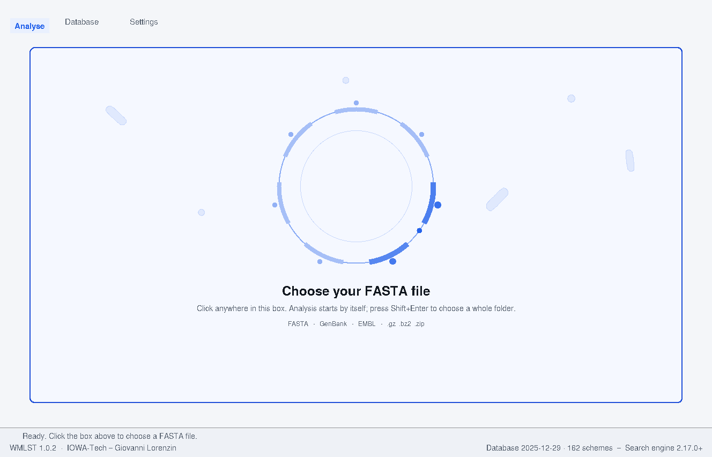
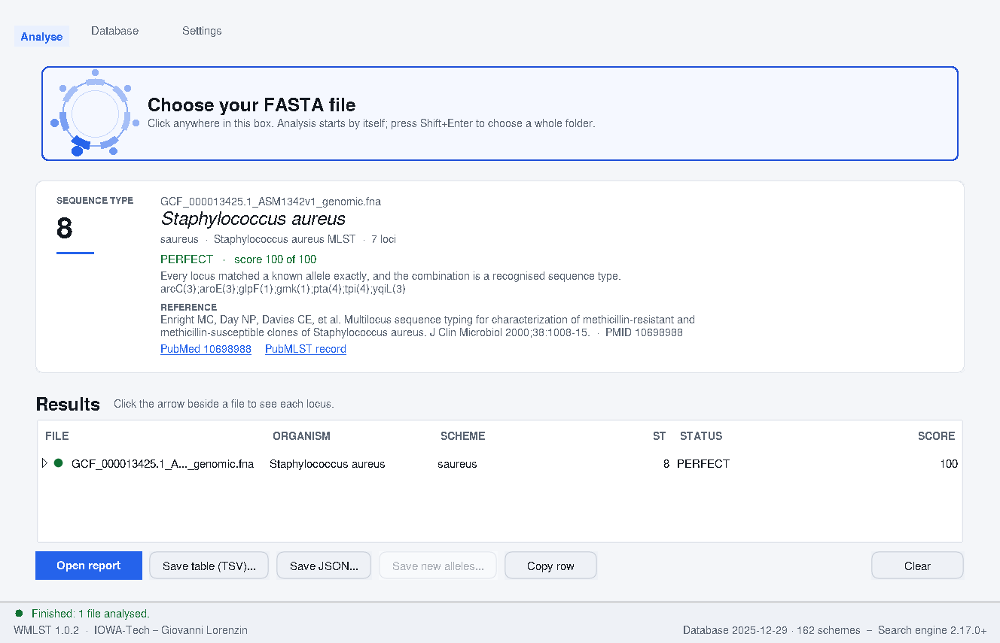
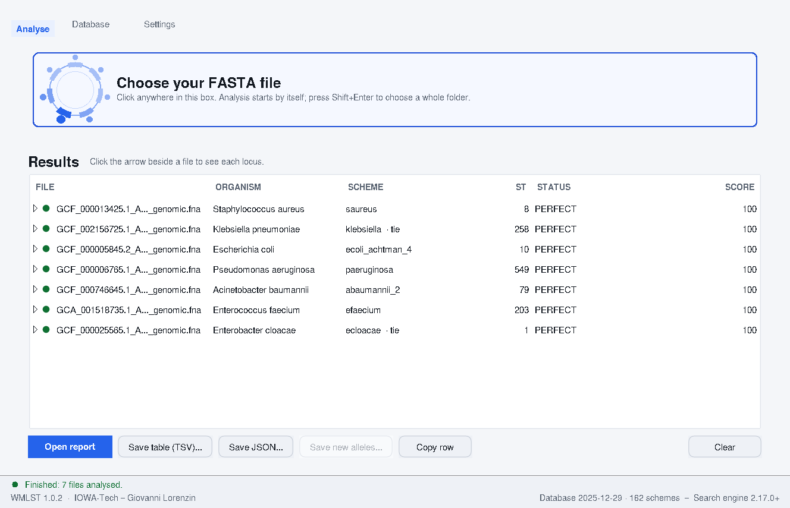
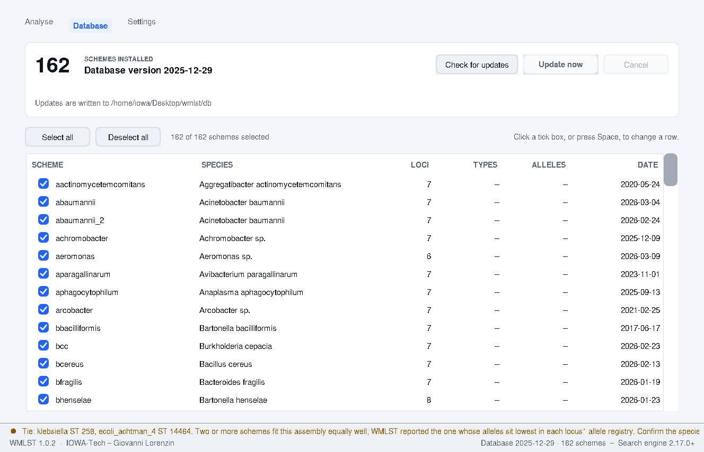

# WMLST

**MLST typing for Windows.** Drop an assembly on the window and get the sequence type.

No installation required, no Python, no command line, no internet connection after the
download. Every scheme and every allele is already inside.

*IOWA-BioTech — Giovanni Lorenzin*

---

## Download

**[⬇ Download WMLST for Windows](https://iowa69.github.io/WMLST/)**

You get a single `.zip`. Unzip it anywhere you like — your Documents folder, a network
share, a USB stick — and run `WMLST.exe` from inside the folder. Nothing is written to
your registry and no administrator password is needed.

> **Windows will say "Windows protected your PC".**
> Click **More info**, then **Run anyway**.
>
> This is Windows SmartScreen. It is not a virus warning. WMLST is **not code-signed** —
> a signing certificate is an annual cost we have not taken on — so SmartScreen has never
> seen this file before and says so. We will never ask you to switch SmartScreen or
> Defender off.
>
> Every release publishes a `SHA256SUMS.txt` so you can confirm the file you downloaded is
> exactly the file that was built. In PowerShell:
>
> ```powershell
> Get-FileHash .\WMLST-win64-portable.zip -Algorithm SHA256
> ```

**Requirements:** Windows 10 or 11, 64-bit. About 200 MB of disk space.

---

## Three steps

### 1. Start it

Double-click `WMLST.exe`.

The first time it runs it spends about a minute preparing its search index. This happens
once and shows a progress bar.



### 2. Drop your assembly on the window

Drag one or more files onto the box — or click it to browse.

Accepted: `.fasta`, `.fa`, `.fna`, `.gbk`, `.embl`, and any of those compressed as
`.gz`, `.bz2` or `.zip`.

**Analysis starts on its own.** There is no button to press.

### 3. Read the result



You get the **sequence type** in large type, the **organism**, the scheme that was used
and how many loci it has, and the allele called at each locus.

The coloured badge tells you how much to trust it:

| Badge | What it means |
| :-- | :-- |
| **PERFECT** | Every locus matched a known allele exactly and the combination is a recognised sequence type. |
| **NOVEL** | Every locus matched exactly, but this combination is not a named sequence type yet. It may be a new one. |
| **MIXED** | A locus matched two different alleles equally well. Usually more than one strain in the assembly — check culture purity. |
| **MISSING** | A locus could not be found. The assembly may be incomplete. No sequence type can be assigned. |
| **OK** | Matched reasonably well, but at least one locus is only approximate. |
| **BAD** | Scored poorly. Treat as unreliable — wrong organism, heavily fragmented, or contaminated. |
| **NONE** | Nothing matched. Check the file really contains assembled contigs. |

---

## Several files at once

Drop a whole folder. Each file becomes a row; click the arrow beside any row to see its
individual loci and the evidence behind each allele call.



WMLST sizes itself to your computer automatically — on a 16-core machine it analyses four
assemblies at a time.

---

## What you can save

| Button | File | Use it for |
| :-- | :-- | :-- |
| **Open report** | `.html` | A single self-contained page: every sample, every locus, the evidence, and a printable summary. Safe to email — it needs no internet and pulls in nothing. |
| **Save table (TSV)** | `.tsv` | One row per assembly. Opens directly in Excel. |
| **Save JSON** | `.json` | The same results for other software to read. |
| **Save new alleles** | `.fasta` | Sequences that were close to a known allele but not identical — candidates worth submitting. |

---

## Keeping the database current



The **Database** tab lists every scheme that is installed, with its species and when it
was last updated.

**Check for updates** looks for newer data; **Update now** downloads it. Tick only the
schemes you care about, or use **Select all**. If a scheme cannot be updated the others
still update, and you get a list of what failed at the end.

Tick **keep the database next to WMLST.exe** and updates are written into the WMLST
folder itself, so a copy on a USB stick stays current wherever you plug it in.

---

## Command line

The same folder contains `wmlst-cli.exe` for scripting.

```
wmlst-cli contigs.fasta
wmlst-cli --full C:\data\*.fasta > results.tsv
wmlst-cli --html report.html --json results.json contigs.fasta
```

`wmlst-cli --help` lists every option.

---

## Licence

GPL-2.0-only. See [`LICENSE`](LICENSE) for the full text and [`NOTICE`](NOTICE) for the
copyright and component notices that accompany it.

---

*WMLST — IOWA-BioTech, Giovanni Lorenzin*
