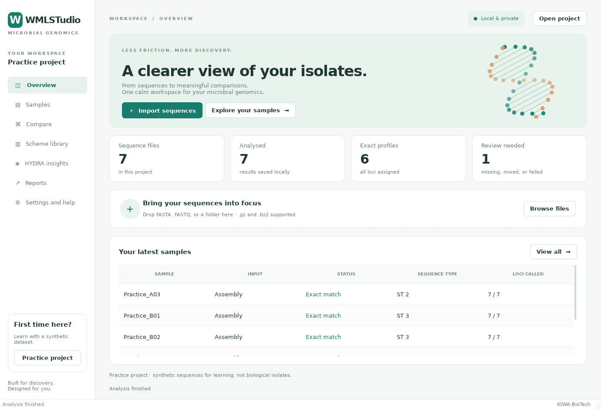

# WMLSTudio

**Your microbial genomics workspace for Windows.** Type assemblies, check sequence
quality, compare isolates and explore HYDRA evidence in one native desktop application.

No installation, separate Python, command line, browser or WSL required. The
portable package includes the application, its runtime and 162 reference schemes;
it does not download databases at startup.

*IOWA-BioTech — Giovanni Lorenzin*

## Download the preview

### [⬇ Download WMLSTudio for Windows — portable ZIP](https://github.com/iowa69/WMLSTudio/releases/download/v0.1.0-preview.1/WMLSTudio-Windows-x64.zip)

**v0.1.0-preview.1 · Windows x64 · 46.3 MB download · approximately 210 MB extracted**

[Release notes and all downloads](https://github.com/iowa69/WMLSTudio/releases/tag/v0.1.0-preview.1)
· [SHA-256 checksum](https://github.com/iowa69/WMLSTudio/releases/download/v0.1.0-preview.1/WMLSTudio-Windows-x64.zip.sha256)
· [Build and test status](https://github.com/iowa69/WMLSTudio/actions/workflows/studio.yml)

This repository is private. Sign in to GitHub with an account that has repository
access before downloading; these links are not anonymous public downloads.

> **Development preview, not a validated production release.** The target is
> Windows 11, 64-bit. The ZIP was built with Windows Python and tested under Wine;
> source tests and frozen builds also passed separately in GitHub Actions on Linux
> and Windows. Clean Windows 11 desktop acceptance remains unfinished.
>
> The application is unsigned, so Windows may show an unknown-publisher or
> SmartScreen warning. Verify the source and checksum before deciding whether to
> run it. Do not disable Defender or SmartScreen; a matching checksum confirms
> file integrity, not that a program is safe.

<details>
<summary>Verify your download in PowerShell</summary>

```powershell
Get-FileHash .\WMLSTudio-Windows-x64.zip -Algorithm SHA256
```

Compare the result with the checksum asset above. For this preview it is:

```text
9470e4e1e27666eec42dfea83d5c09b71ada25b38933dc83bd4648cca34422f3
```

</details>

## Three steps

### 1. Extract and open

Right-click the downloaded ZIP, choose **Extract All**, and extract into a writable
folder such as Documents. Open the extracted `WMLSTudio` folder and double-click
`WMLSTudio.exe`. Keep the entire folder together, including `_internal`; do not run
the executable from inside the ZIP or move it on its own.

### 2. Try the practice project

Click **Practice project** in the lower-left corner. It creates and analyses seven
clearly labelled synthetic assemblies, so you can explore without preparing data.
Open **Samples** to inspect the calls, then **Compare** to explore their relationships.



*Actual frozen Windows application under Wine; the displayed samples are synthetic.*

### 3. Analyse your own sequences

Create or open your own project, then drag in FASTA/FASTQ files or a folder. On
**Samples**, select the correct organism's scheme and click **Analyse pending**.
Select a sample to inspect its quality summary, allele evidence and provenance.

Accepted: FASTA (`.fasta`, `.fa`, `.fna`) and FASTQ (`.fastq`, `.fq`), including
gzip (`.gz`) and bzip2 (`.bz2`) compression. **Assemblies receive exact typing;
FASTQ reads receive quality checks only.** This preview does not assemble reads.

## Comparing isolates

After typing two or more assemblies, open **Compare**. The interactive minimum
spanning forest shows allele differences, with zoom, pan, draggable nodes and PNG
export. Only profiles with compatible scheme fingerprints and sufficient shared
loci are compared. Missing calls are not counted as matches; disconnected samples
remain visible. Visual groups are an exploration aid, not an outbreak diagnosis.

## HYDRA evidence

Open **HYDRA insights → Import HYDRA JSON** to view previously computed resistance,
virulence, mutation, plasmid and lineage evidence. The original report's parameters,
database information and provenance are preserved. **This does not run HYDRA's
analysis engines.** See [the integration assessment](docs/HYDRA_INTEGRATION.md).

## Saving and sharing

Projects save automatically. Use **Reports** for PDF/HTML reports and CSV/TSV/JSON
exports. **Save project copy** carries results and metadata to another computer;
the original sequence files remain separate and are needed to rerun an analysis.
HYDRA insights also exports the complete imported evidence as JSON.

Workspaces and imported schemes live under `Data` beside the executable. Back up
that folder and your original sequence files. Original inputs are never edited,
and exports refuse to replace sequence inputs or the current project.

## What works in this preview

- A native, animated Qt workspace with a compact-screen layout and reduced-motion setting.
- Drag-and-drop sequence import; uncompressed/gzip/bzip2 FASTA and FASTQ.
- Assembly QC and exact known-allele MLST, with 162 existing PubMLST schemes.
- Local MLST/cgMLST scheme import with content fingerprints and background validation.
- Bounded FASTQ QC, explicitly labelled as a sample of the file when appropriate.
- Saved SQLite projects, sample metadata, cancellable jobs and interrupted-job recovery.
- Interactive minimum spanning forests, shared-locus evidence and adjustable visual groups.
- HYDRA JSON import: native AMR, virulence, mutation, plasmid and lineage evidence views.
- PDF/HTML reports, CSV/TSV/JSON exports and full HYDRA evidence export.

This is a research preview. It does **not** yet assemble raw reads, infer novel
alleles, run HYDRA's engines, perform phenotype prediction, or establish SeqSphere+
parity. Imported cgMLST uses exact known alleles; a missing match is not a novel
allele call. See [the capability audit](docs/STUDIO_CAPABILITIES.md) and
[HYDRA integration assessment](docs/HYDRA_INTEGRATION.md).

Every typed result retains its input SHA-256, scheme fingerprint, parameters,
software version and individual allele evidence. Closing during a job requests safe
cancellation. Failed/interrupted samples can be retried. Two application windows
cannot open the same project concurrently.

## Develop and test

```bash
uv sync --locked
uv run python studio_scripts/stage_schemes.py --source ../wmlst/db/pubmlst
uv run python -m wmlstudio
```

Alternatively stage the pinned source snapshot with `--download`. Without staged
schemes, QC, custom scheme import and the practice project still work. This build
does not download databases at application startup.

```bash
QT_QPA_PLATFORM=offscreen uv run pytest
uv run ruff check src/wmlstudio studio_tests studio_scripts studio_packaging
QT_QPA_PLATFORM=offscreen uv run python studio_scripts/capture_desktop.py
```

On Windows, set `$env:QT_QPA_PLATFORM = "offscreen"` in PowerShell for headless
tests, then `uv run pytest`. Unset that variable before using the GUI normally.
Linux desktop development needs the standard Qt platform libraries, including
`libxcb-cursor0` for X11. Headless tests use the offscreen platform.

The command-line companion uses the same engine:

```bash
uv run wmlstudio-cli type isolate.fasta --scheme path/to/scheme -o results.json
uv run wmlstudio-cli qc reads.fastq.gz --max-reads 10000 -o quality.json
uv run wmlstudio-cli check-pair isolate_R1.fastq.gz isolate_R2.fastq.gz
uv run wmlstudio-cli compare results.json -o distances.json
```

See [Windows build instructions](docs/STUDIO_WINDOWS.md) for packaging and
acceptance checks. The [initial Linux and Windows CI run](https://github.com/iowa69/WMLSTudio/actions/runs/34705226772)
passed both test and frozen-build jobs; hosted Windows CI does not establish a
successful clean Windows 11 desktop acceptance test.

This repository contains the new native implementation in `src/wmlstudio`.
Legacy WMLST source/history and reference databases are not included. Existing
sibling projects are reference inputs only; schemes are staged explicitly using
the commands above. Local sequence data and generated builds stay out of Git.

## Environment

Python 3.12, uv lockfile, PySide6 native widgets and pyahocorasick. Development and
real-data validation run on Linux; Windows binaries are built with Windows Python.
Database sources already present: `../wmlst/db/pubmlst` and MLSTudio local caches.

## Layout

- `src/wmlstudio`: application, analysis, project files and bundled demonstration.
- `studio_tests`: scientific, persistence and GUI tests.
- `studio_scripts`: build and reproducible validation drivers.
- `tasks`: methods, decisions, outstanding work and test hypotheses.
- `results`: generated local validation evidence, excluded from version control.

Measured validation and exact commands are recorded in `tasks/METHODS.md`,
`SUMMARY.md`, and the generated validation reports. Reference data and dependency
terms are documented in `studio_packaging/THIRD_PARTY_NOTICES.md`.
